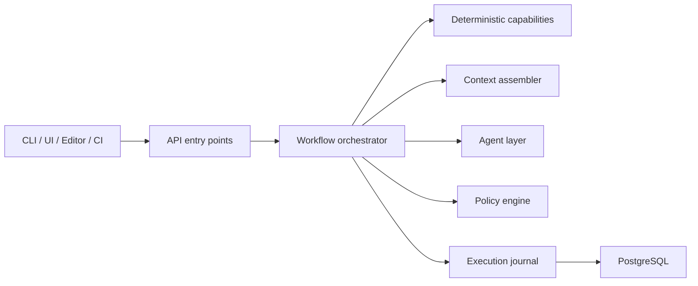

# Specwright

> Deterministic-first, spec-driven engineering for AI-assisted .NET teams.

Specwright is a codebase-aware engineering platform for teams that want AI to operate inside architecture, policy, and evidence boundaries instead of around them.

It is being built to give AI-assisted engineering something most teams still do not have: durable project memory, bounded context, deterministic analysis, and workflow-level accountability.

It is being built around a simple rule:

> LLMs should not be the first component to inspect a codebase.

Before model reasoning happens, Specwright is designed to inspect code, diffs, and documents deterministically, assemble bounded context, apply guardrails, and record why an outcome was accepted or rejected.

## At a Glance

- **Built for `.NET 10`** with `.NET Aspire`, `ASP.NET Core`, `EF Core`, `Roslyn`, and `PostgreSQL`
- **Deterministic-first by design** so workflows start from evidence, not guesswork
- **Markdown-driven project memory** through `architecture.md`, `current-state.md`, `roadmap.md`, and `ai-context.md`
- **Policy-enforced workflows** designed to connect intent, implementation, and review
- **Brownfield-friendly** so teams can understand existing systems instead of starting from scratch

## Table of Contents

- [At a Glance](#at-a-glance)
- [Why This Matters](#why-this-matters)
- [What Specwright Is](#what-specwright-is)
- [How It Works](#how-it-works)
- [Current Status](#current-status)
- [What Makes It Different](#what-makes-it-different)
- [Start Here](#start-here)
- [If You Are Evaluating the Product Direction](#if-you-are-evaluating-the-product-direction)
- [If You Want to Use the Document Model Right Now](#if-you-want-to-use-the-document-model-right-now)
- [If You Want the Deep-Dive Architecture Thinking](#if-you-want-the-deep-dive-architecture-thinking)
- [Explore the Project](#explore-the-project)
- [Philosophy](#philosophy)
- [Roadmap Snapshot](#roadmap-snapshot)
- [Contributing](#contributing)
- [License](#license)

## Why This Matters

Every new AI session starts with amnesia.

Your assistant does not remember what you are building, what decisions were already made, what rules your codebase follows, or what tradeoffs the team already accepted. So you re-explain the architecture, re-state the roadmap, and re-teach the same constraints over and over.

That is annoying in small projects. In real systems, it becomes risky:

- architecture rules get violated
- specs drift from implementation
- reviews become opinionated instead of evidence-based
- project knowledge disappears between sessions
- "smart" output arrives with no audit trail

Specwright exists to make AI-assisted engineering more structured, more explainable, and more repeatable.

## What Specwright Is

Specwright is evolving into a `.NET 10` platform built with `.NET Aspire`, `ASP.NET Core`, `EF Core`, `Roslyn`, and `PostgreSQL`.

Its goal is to combine:

- persistent project memory
- spec-driven delivery
- deterministic analysis
- bounded context assembly
- policy-enforced workflows
- auditable execution records

The current design is centered around three layers:

1. **Foundation layer**  
   Shared project memory in markdown: `architecture.md`, `current-state.md`, `roadmap.md`, and `ai-context.md`.
2. **Spec layer**  
   Feature-level design and implementation accountability through `spec.md` and `implementation-notes.md`.
3. **Execution layer**  
   Workflows, capabilities, retrieval, agents, policies, and CI enforcement.

## How It Works

At a high level:

1. A user or system invokes a workflow from the CLI, editor, UI, or CI.
2. Specwright gathers deterministic facts first: code, diffs, symbols, and documents.
3. A bounded context packet is assembled with evidence, scope, and known unknowns.
4. An agent reasons only after the deterministic groundwork is done.
5. Policies validate required artifacts and evidence quality.
6. The outcome is recorded so the workflow can be explained later.

This is the difference between "better prompts" and an actual engineering system.

## Current Status

Specwright is currently in **Phase 0: platform reset and foundation setup**.

The direction is now defined, but the runnable `.NET 10 + Aspire + PostgreSQL` scaffold is still being built. Today, this repository contains the architecture, roadmap, templates, examples, and manual workflow assets that define the contract the platform will automate.

> **Current reality:** the docs are ahead of the runtime on purpose. The product direction is defined; the executable platform is the next major step.

Start here if you want the clearest picture of where the project is headed and what is true today:

- [`docs/architecture.md`](docs/architecture.md)
- [`docs/current-state.md`](docs/current-state.md)
- [`docs/roadmap.md`](docs/roadmap.md)
- [`docs/ai-context.md`](docs/ai-context.md)

## What Makes It Different

- **Deterministic-first**  
  Specwright prefers Roslyn, diff inspection, and document parsing before model reasoning.

- **Bounded context by default**  
  Context is assembled deliberately instead of dumping the whole repo into a prompt.

- **Markdown as source of truth**  
  Foundation and feature documents stay human-readable, versioned, and portable.

- **Policy-enforced discipline**  
  Required artifacts, citations, and architecture rules are meant to be checked, not merely suggested.

- **Built for brownfield understanding**  
  The platform is designed to help teams understand existing systems, not just greenfield projects.

## Start Here

### If You Are Evaluating the Product Direction

Read the foundation docs in this order:

1. [`docs/architecture.md`](docs/architecture.md)
2. [`docs/current-state.md`](docs/current-state.md)
3. [`docs/roadmap.md`](docs/roadmap.md)
4. [`docs/ai-context.md`](docs/ai-context.md)

### If You Want to Use the Document Model Right Now

1. Start with the templates in `templates/foundation/`.
2. Use the examples in `examples/` as style references.
3. Use `skills/architect.md` and `skills/engineer.md` as a manual workflow layer.

### If You Want the Deep-Dive Architecture Thinking

Read [`new-Specwright-arch-draft.md`](new-Specwright-arch-draft.md). It captures the broader architecture direction that informed the current `docs/` set.

## Explore the Project

### `docs/`

The new center of gravity for this project.

- [`docs/architecture.md`](docs/architecture.md): what Specwright is being built to become
- [`docs/current-state.md`](docs/current-state.md): what is true right now
- [`docs/roadmap.md`](docs/roadmap.md): phased execution plan
- [`docs/ai-context.md`](docs/ai-context.md): guardrails and working rules
- [`docs/decisions/README.md`](docs/decisions/README.md): ADR conventions and decision tracking

### `templates/`

These are still valuable today. They show the artifact model the platform is designed to generate, enforce, and keep current.

- `templates/foundation/`: templates for `architecture.md`, `current-state.md`, `roadmap.md`, and `ai-context.md`
- `templates/feature/`: templates for `spec.md` and `implementation-notes.md`
- `templates/developer/`: `developer-context-template.md`

### `examples/`

Reference examples of filled documents from a production `.NET` feature flag service:

- `examples/architecture-example.md`
- `examples/current-state-example.md`
- `examples/roadmap-example.md`
- `examples/spec-example.md`
- `examples/implementation-notes-example.md`

These are examples of the document model, not examples of the future Specwright runtime.

### `skills/`

The skill files remain useful as a manual workflow while the platform is being built:

- `skills/architect.md`
- `skills/engineer.md`

They are still helpful if you want to use the Specwright document model with your current AI tooling today, but they are no longer the whole story.

## Philosophy

**Specs are not tickets.** A spec should capture design intent, rationale, constraints, and what done means.

**Foundation docs are living system memory.** If they are stale, both humans and AI are working from fiction.

**Deterministic analysis comes before model reasoning.** Models are useful, but they should operate on bounded evidence instead of first-contact guesswork.

**Evidence beats confident prose.** A workflow outcome should be explainable after the fact.

**The engineer is not a transcription service.** Good engineering workflows challenge assumptions, surface risks, and improve the design.

**Model-agnostic where it matters.** The system is `.NET`-first, but its core workflow concepts should not require lock-in to a single model provider.

## Roadmap Snapshot

- **Phase 0:** platform reset + Aspire bootstrap
- **Phase 1:** analyzer vertical slice
- **Phase 2:** foundation generator + retrieval hardening
- **Phase 3:** policy engine + reviewer gate MVP
- **Phase 4:** CI and observability expansion
- **Phase 5:** modular extraction + packaging transition

The canonical roadmap lives in [`docs/roadmap.md`](docs/roadmap.md).

## Contributing

Specwright is being built in the open. Ideas, issues, and pull requests are welcome, especially if they help clarify the platform architecture, document model, or bootstrap path.

If you are contributing, use the `docs/` set as your starting context for every session.

## License

MIT - Jose Rodriguez-Marrero
