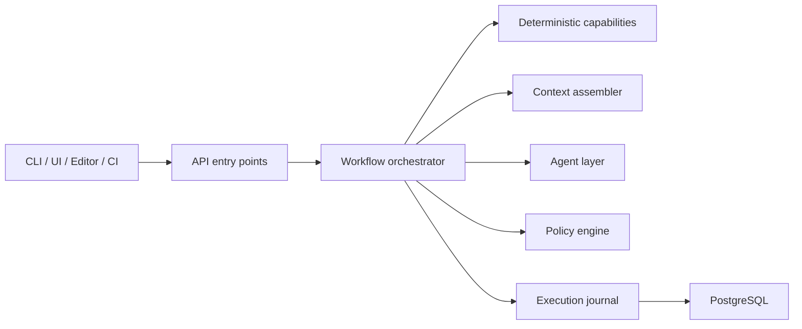

# Specwright

> Deterministic-first, policy-enforced engineering for AI-assisted .NET teams.

Specwright is a codebase-aware engineering operating system for teams that want AI to operate inside architecture, policy, and evidence boundaries instead of around them.

It provides durable project memory, bounded context assembly, deterministic analysis, and adaptive workflow governance so AI outputs remain auditable and aligned with architectural intent.

---

## Table of Contents

- [At a Glance](#at-a-glance)
- [Why This Matters](#why-this-matters)
- [What Specwright Is](#what-specwright-is)
- [How It Works](#how-it-works)
- [Current Status](#current-status)
- [What Makes It Different](#what-makes-it-different)
- [Start Here](#start-here)
- [Explore the Project](#explore-the-project)
- [Philosophy](#philosophy)
- [Roadmap Snapshot](#roadmap-snapshot)
- [Contributing](#contributing)
- [License](#license)

---

## At a Glance

- Built for `.NET 10` with `.NET Aspire`, `ASP.NET Core`, `EF Core`, `Roslyn`, and `PostgreSQL`
- Deterministic-first architecture: analysis before model reasoning
- Markdown-based system memory (`architecture.md`, `current-state.md`, `roadmap.md`, `ai-context.md`)
- Capability-driven execution model (not agent blobs)
- Policy-enforced workflows with impact-based rigor (L1/L2/L3)
- Designed for both greenfield and brownfield systems

---

## Why This Matters

Every AI session starts with amnesia.

Your assistant does not know:

- what your system looks like
- what decisions have already been made
- what rules your architecture enforces
- what tradeoffs your team has accepted

So you repeat yourself.

In real systems, this becomes risk:

- architecture rules get violated
- specs drift from implementation
- reviews become subjective
- outputs are not auditable
- decisions disappear between sessions

Specwright exists to fix that.

---

## What Specwright Is

Specwright is a `.NET 10` engineering platform built around three layers:

### 1. Foundation Layer

Shared project memory:

- `architecture.md`
- `current-state.md`
- `roadmap.md`
- `ai-context.md`

These define:

- system intent
- current reality
- future direction
- operational rules

---

### 2. Spec Layer

Design and execution accountability:

- `spec.md`
- `implementation-notes.md`

This connects:

- design → implementation → reality

---

### 3. Execution Layer

The runtime system (in progress):

- workflows
- capabilities
- context assembly
- agents
- policy and governance
- CI/PR enforcement

---

## How It Works

**Execution Flow**

1. A workflow is triggered from CLI, UI, editor, or CI.
2. Deterministic analysis runs first (code, diffs, documents).
3. A bounded context packet is assembled.
4. An agent reasons over that bounded context.
5. Policies validate correctness and completeness.
6. The outcome is recorded with evidence.

---

**Current Status**

Specwright is in **Phase 0: Foundation Stabilization**.

The architecture is defined, but the runtime system is not yet implemented.

Current reality:

architecture is aligned and stable
foundation docs are the source of truth
workflows are manual
no enforcement layer exists yet
no runtime orchestration exists yet

Next step:

move from defined system → executable platform

Start here:

[docs/architecture.md](/docs/architecture.md)
[docs/current-state.md](/docs/current-state.md)
[docs/roadmap.md](/docs/roadmap.md)
[docs/ai-context.md](/docs/ai-context.md)

---

## What Makes It Different
**Deterministic-first**
Analysis happens before model reasoning.

**Bounded context**
Inputs are scoped, not dumped.

**Capabilities over agents**
Agents are composed from small, testable capabilities.

**Policy-enforced workflows**
Rules are intended to be enforced, not suggested.

**Impact-based governance**
Workflow rigor adapts based on change impact:
- L1: local change
- L2: feature change
- L3: architectural change

**Workflow integration**
Specwright augments PRs and CI instead of replacing them.

## Start Here
**Understanding the System**
[docs/architecture.md](/docs/architecture.md)
[docs/current-state.md](/docs/current-state.md)
[docs/roadmap.md](/docs/roadmap.md)
[docs/ai-context.md](/docs/ai-context.md)

## Using the Model Today
templates/ → document structure
examples/ → reference implementations
skills/ → manual AI workflow

## Explore the Project

[docs/](/docs/)
Core system definition:

- architecture
- current state
- roadmap
- rules and guardrails

[templates/](/templates/)
Document templates for:

- foundation docs
- feature specs
- implementation notes

[examples/](/examples/)

Concrete examples of the document model in use.

[skills/](/skills/)

Temporary workflow layer for using Specwright before runtime exists.

## Philosophy

- Specs are design documents, not tickets
- Foundation docs are living system memory
- Deterministic analysis comes before model reasoning
- Evidence matters more than confidence
- Engineers challenge design, not blindly implement it
- AI operates inside constraints, not outside them

## Roadmap Snapshot

- Phase 0: foundation stabilization
- Phase 1: runtime bootstrap (.NET 10 + Aspire)
- Phase 2: capability system + analyzer
- Phase 3: agent layer
- Phase 4: policy enforcement
- Phase 5: CI/PR integration
- Phase 6: Aspire orchestration
- Phase 7: brownfield intelligence

See full roadmap:

[docs/roadmap.md](/docs/roadmap.md)

## Contributing

Contributions are welcome.

If you are contributing:

- start with docs/
- align with architecture
- treat docs as source of truth
- maintain traceability

## License

MIT - Jose Rodriguez-Marrero